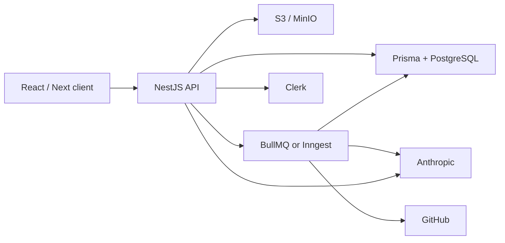

# Polaris backend analysis

Polaris is **not** a classic standalone API server. Backend logic is split across three layers:

| Layer | Technology | Role |
|-------|------------|------|
| HTTP API | **Next.js 16** Route Handlers | Auth-gated REST-style endpoints |
| Data + “real-time” | **Convex** | DB, file storage, client queries/mutations |
| Background jobs | **Inngest** | AI agent, GitHub import/export |

There is **no** Express, Fastify, NestJS, or Prisma in this repo.

---

## 1. Data model (Convex → equivalent relational model)

From `convex/schema.ts`:

```
projects (ownerId)
  ├── files (tree: parentId self-ref)
  ├── conversations
  │     └── messages
  └── settings, importStatus, exportStatus on project
```

| Table | Fields | Notes |
|-------|--------|-------|
| **projects** | `name`, `ownerId`, `updatedAt`, optional `importStatus`, `exportStatus`, `exportRepoUrl`, `settings` | Owner-scoped |
| **files** | `projectId`, `parentId?`, `name`, `type` (file\|folder), `content?`, `storageId?` | Text in DB; binaries in Convex storage |
| **conversations** | `projectId`, `title`, `updatedAt` | |
| **messages** | `conversationId`, `projectId`, `role`, `content`, `status?` | `processing` \| `completed` \| `cancelled` |

---

## 2. Authentication & authorization

| Feature | Implementation |
|---------|----------------|
| User auth | **Clerk** (`auth()`, `clerkMiddleware`) |
| Convex auth | Clerk JWT → `verifyAuth()` in `convex/auth.ts` |
| Resource access | **Owner check**: `project.ownerId === identity.subject` |
| Billing gate | **Clerk Pro plan**: `has({ plan: "pro" })` on GitHub routes |
| Service-to-service | **`POLARIS_CONVEX_INTERNAL_KEY`** on all `convex/system.ts` functions |

No RBAC roles beyond “owner” and “pro plan”.

---

## 3. User-facing data API (Convex, not HTTP)

These are called from the React client via `useQuery` / `useMutation`:

**Projects** (`convex/projects.ts`): `get`, `getPartial`, `getById`, `create`, `rename`, `updateSettings`

**Files** (`convex/files.ts`): `getFiles`, `getFile`, `getFilePath`, `getFolderContents`, `createFile`, `createFolder`, `renameFile`, `deleteFile`, `updateFile`

**Conversations** (`convex/conversations.ts`): `getById`, `getByProject`, `getMessages`, `create`

**Real-time**: Convex reactive queries (no WebSocket server in your code).

---

## 4. HTTP API routes (Next.js)

| Method | Path | Purpose |
|--------|------|---------|
| POST | `/api/messages` | Send chat message → create messages → Inngest `message/sent` |
| POST | `/api/messages/cancel` | Cancel processing messages |
| POST | `/api/projects/create-with-prompt` | Create project + conversation from prompt |
| POST | `/api/suggestion` | Inline AI code completion (Claude) |
| POST | `/api/quick-edit` | Cmd+K edit (Claude + optional Firecrawl) |
| POST | `/api/github/import` | Import repo (Pro) → Inngest `github/import.repo` |
| POST | `/api/github/export` | Export to new GitHub repo (Pro) |
| POST | `/api/github/export/cancel` | Cancel export |
| POST | `/api/github/export/reset` | Reset export status |
| GET/POST/PUT | `/api/inngest` | Inngest webhook |

All routes use **Zod** for request validation and return standard HTTP status codes.

---

## 5. Internal / worker API (`convex/system.ts`)

Used by Next.js routes and Inngest workers (protected by internal key):

- **Queries**: `getConversationById`, `getProcessingMessages`, `getRecentMessages`, `getProjectFiles`, `getFileById`, `getProjectFilesWithUrls`, …
- **Mutations**: `createMessage`, `updateMessageContent`, `updateMessageStatus`, file CRUD, `createProject`, `createProjectWithConversation`, `generateUploadUrl`, `createBinaryFile`, import/export status updates, `cleanup`

---

## 6. Background jobs (Inngest)

| Function | Event | Purpose |
|----------|-------|---------|
| `process-message` | `message/sent` | AI coding agent (AgentKit + tools); cancel on `message/cancel` |
| `import-github-repo` | `github/import.repo` | Clone GitHub tree into files |
| `export-to-github` | `github/export.repo` | Push project to new GitHub repo |

Agent tools: read/list/create/update/rename/delete files, scrape URLs (Firecrawl).

---

## 7. File storage

- **Text files**: stored in `files.content`
- **Binary files**: Convex `_storage` via `generateUploadUrl` + `createBinaryFile`
- Deletion removes storage blob when applicable

---

## 8. Third-party integrations

| Service | Use |
|---------|-----|
| **Clerk** | Auth, GitHub OAuth tokens |
| **Anthropic** | Suggestions, quick-edit, AI agent |
| **Firecrawl** | URL scraping for docs context |
| **GitHub (Octokit)** | Import/export |
| **Sentry** | Errors + LLM monitoring |
| **Inngest** | Job orchestration |

**Not present**: email, Stripe, SQL DB, raw WebSockets, cron.

---

## 9. Environment variables

| Variable | Purpose |
|----------|---------|
| `NEXT_PUBLIC_CLERK_PUBLISHABLE_KEY` | Clerk client |
| `CLERK_SECRET_KEY` | Clerk server |
| `NEXT_PUBLIC_CONVEX_URL` | Convex client |
| `POLARIS_CONVEX_INTERNAL_KEY` | Server ↔ DB internal API |
| `CLERK_JWT_ISSUER_DOMAIN` | Convex JWT validation |
| `ANTHROPIC_API_KEY` | AI SDK |
| `FIRECRAWL_API_KEY` | Scraping |
| `SENTRY_DSN` | Monitoring |
| Inngest keys | `INNGEST_EVENT_KEY`, `INNGEST_SIGNING_KEY` (deployment) |

---

# Guide: replicate Polaris backend in NestJS + Prisma

This maps each Polaris capability to a conventional NestJS stack. Your frontend would call REST/GraphQL instead of Convex hooks, and you’d add real-time yourself (WebSockets or SSE).

## Architecture overview



---

## Step 1 — Bootstrap NestJS project

```bash
npm i -g @nestjs/cli
nest new polaris-api
cd polaris-api
npm i @prisma/client prisma zod class-validator class-transformer
npm i @clerk/clerk-sdk-node @nestjs/config
npx prisma init
```

Use **PostgreSQL** (closest to relational needs: trees, indexes, JSON for `settings`).

---

## Step 2 — Prisma schema (1:1 with Convex)

```prisma
// prisma/schema.prisma

enum FileType { file folder }
enum MessageRole { user assistant }
enum MessageStatus { processing completed cancelled }
enum ImportStatus { importing completed failed }
enum ExportStatus { exporting completed failed cancelled }

model Project {
  id            String   @id @default(cuid())
  name          String
  ownerId       String   // Clerk user id
  updatedAt     DateTime @updatedAt
  importStatus  ImportStatus?
  exportStatus  ExportStatus?
  exportRepoUrl String?
  installCommand String?
  devCommand     String?

  files         File[]
  conversations Conversation[]
  messages      Message[]

  @@index([ownerId])
}

model File {
  id         String   @id @default(cuid())
  projectId  String
  parentId   String?
  name       String
  type       FileType
  content    String?  // text only
  storageKey String?  // S3 key for binary
  updatedAt  DateTime @updatedAt

  project    Project  @relation(fields: [projectId], references: [id], onDelete: Cascade)
  parent     File?    @relation("FileTree", fields: [parentId], references: [id])
  children   File[]   @relation("FileTree")

  @@index([projectId])
  @@index([parentId])
  @@index([projectId, parentId])
}

model Conversation {
  id        String   @id @default(cuid())
  projectId String
  title     String
  updatedAt DateTime @updatedAt

  project   Project  @relation(fields: [projectId], references: [id], onDelete: Cascade)
  messages  Message[]

  @@index([projectId])
}

model Message {
  id             String         @id @default(cuid())
  conversationId String
  projectId      String
  role           MessageRole
  content        String
  status         MessageStatus?

  conversation   Conversation @relation(fields: [conversationId], references: [id], onDelete: Cascade)
  project        Project      @relation(fields: [projectId], references: [id], onDelete: Cascade)

  @@index([conversationId])
  @@index([projectId, status])
}
```

Run `npx prisma migrate dev`.

---

## Step 3 — Auth (replace Convex `verifyAuth`)

**Option A — Keep Clerk** (closest to Polaris):

```bash
npm i @clerk/clerk-sdk-node
```

```typescript
// src/auth/clerk.guard.ts
import { CanActivate, ExecutionContext, Injectable, UnauthorizedException } from '@nestjs/common';
import { verifyToken } from '@clerk/backend';

@Injectable()
export class ClerkAuthGuard implements CanActivate {
  async canActivate(ctx: ExecutionContext) {
    const req = ctx.switchToHttp().getRequest();
    const token = req.headers.authorization?.replace('Bearer ', '');
    if (!token) throw new UnauthorizedException();
    const payload = await verifyToken(token, { secretKey: process.env.CLERK_SECRET_KEY });
    req.userId = payload.sub;
    return true;
  }
}
```

**Owner guard** (replaces `project.ownerId !== identity.subject`):

```typescript
// src/projects/projects.service.ts
async assertOwner(projectId: string, userId: string) {
  const project = await this.prisma.project.findUnique({ where: { id: projectId } });
  if (!project) throw new NotFoundException();
  if (project.ownerId !== userId) throw new ForbiddenException();
  return project;
}
```

**Pro plan gate** (GitHub routes): call Clerk Billing API or store `plan` on a `User` table synced via Clerk webhooks.

---

## Step 4 — Module structure (mirror Polaris domains)

```
src/
  projects/     # CRUD, settings, create-with-prompt
  files/        # tree CRUD
  conversations/
  messages/     # HTTP: send, cancel
  ai/           # suggestion, quick-edit
  github/       # import, export, cancel, reset
  jobs/         # Inngest or BullMQ processors
  storage/      # S3 upload URLs
  internal/     # optional: API-key guarded endpoints for workers
```

---

## Step 5 — Map Convex functions → NestJS controllers

### Projects (was `convex/projects.ts`)

| Convex | NestJS |
|--------|--------|
| `projects.get` | `GET /projects` |
| `projects.getPartial?limit=` | `GET /projects?limit=10` |
| `projects.getById` | `GET /projects/:id` |
| `projects.create` | `POST /projects` |
| `projects.rename` | `PATCH /projects/:id` |
| `projects.updateSettings` | `PATCH /projects/:id/settings` |

```typescript
@Controller('projects')
@UseGuards(ClerkAuthGuard)
export class ProjectsController {
  @Get()
  findAll(@Req() req) {
    return this.service.findByOwner(req.userId);
  }

  @Post()
  create(@Req() req, @Body() dto: CreateProjectDto) {
    return this.service.create(req.userId, dto.name);
  }
}
```

### Files (was `convex/files.ts`)

| Convex | NestJS |
|--------|--------|
| `getFiles` | `GET /projects/:projectId/files` |
| `getFile` | `GET /files/:id` |
| `getFolderContents` | `GET /files/:id/children` |
| `createFile`, `createFolder`, etc. | `POST/PATCH/DELETE /files/...` |

Implement tree logic with `parentId` the same way Convex does.

### Conversations (was `convex/conversations.ts`)

| Convex | NestJS |
|--------|--------|
| `getByProject` | `GET /projects/:projectId/conversations` |
| `getMessages` | `GET /conversations/:id/messages` |
| `create` | `POST /projects/:projectId/conversations` |

---

## Step 6 — Map HTTP routes (was `src/app/api/*`)

### `POST /messages` → `MessagesController`

Polaris flow:

1. Auth user  
2. Load conversation  
3. Cancel any `processing` messages (emit cancel event + update status)  
4. Create user message + assistant placeholder (`status: processing`)  
5. Emit `message/sent` to job queue  

```typescript
@Post()
@UseGuards(ClerkAuthGuard)
async send(@Req() req, @Body() body: SendMessageDto) {
  const conversation = await this.conversations.findOne(body.conversationId);
  await this.projects.assertOwner(conversation.projectId, req.userId);

  const processing = await this.prisma.message.findMany({
    where: { projectId: conversation.projectId, status: 'processing' },
  });

  for (const msg of processing) {
    await this.queue.emit('message/cancel', { messageId: msg.id });
    await this.prisma.message.update({ where: { id: msg.id }, data: { status: 'cancelled' } });
  }

  await this.prisma.message.create({ data: { role: 'user', content: body.message, ... } });
  const assistant = await this.prisma.message.create({
    data: { role: 'assistant', content: '', status: 'processing', ... },
  });

  await this.queue.emit('message/sent', {
    messageId: assistant.id,
    conversationId: body.conversationId,
    projectId: conversation.projectId,
    message: body.message,
  });

  return { success: true, messageId: assistant.id };
}
```

### AI routes

| Polaris | NestJS |
|---------|--------|
| `POST /api/suggestion` | `POST /ai/suggestion` |
| `POST /api/quick-edit` | `POST /ai/quick-edit` |

Use `@ai-sdk/anthropic` in a `AiService` (same Zod schemas as Polaris). Inject Firecrawl client for quick-edit doc context.

### GitHub routes

| Polaris | NestJS |
|---------|--------|
| `POST /api/github/import` | `POST /github/import` |
| `POST /api/github/export` | `POST /github/export` |
| cancel / reset | same paths |

- Guard with `ClerkAuthGuard` + **Pro plan** check  
- Get GitHub token via Clerk: `clerkClient.users.getUserOauthAccessToken(userId, 'github')`  
- Enqueue `github/import.repo` or `github/export.repo` instead of `inngest.send`

### `POST /projects/create-with-prompt`

Single endpoint that:

1. Creates `Project` + `Conversation` in a transaction  
2. Creates initial user message  
3. Enqueues `message/sent` (same as Polaris `create-with-prompt` route)

---

## Step 7 — Background jobs (replace Inngest)

**Option A — Keep Inngest** (easiest port): add `@inngest/nest` or serve Inngest from a Nest controller; move `process-message.ts`, `import-github-repo.ts`, `export-to-github.ts` almost unchanged, swapping `convex.query/mutation` for `PrismaService`.

**Option B — BullMQ** (fully Nest-native):

```bash
npm i @nestjs/bullmq bullmq ioredis
```

```typescript
// jobs/process-message.processor.ts
@Processor('messages')
export class ProcessMessageProcessor {
  @Process('message/sent')
  async handle(job: Job<MessageSentPayload>) {
    // Same logic as process-message.ts:
    // - get recent messages
    // - run AgentKit network with tools
    // - tools call FilesService instead of convex.system.*
    // - update message content on completion
  }
}
```

**Cancellation**: BullMQ supports job removal by id; mirror Inngest `cancelOn` by storing `jobId` on the message row or using a Redis cancel flag checked in the processor loop.

**Failure handler**: on catch, `updateMessageContent` with the same apology string as Polaris `onFailure`.

---

## Step 8 — AI agent tools (replace Convex `system.*` calls)

Each tool in `src/features/conversations/inngest/tools/` becomes a Nest injectable that uses `FilesService`:

| Tool | NestJS service method |
|------|----------------------|
| `read-files` | `filesService.readMany(projectId, paths)` |
| `list-files` | `filesService.list(projectId, parentId?)` |
| `update-file` | `filesService.update(id, content)` |
| `create-files` | `filesService.createMany(...)` |
| `create-folder` | `filesService.createFolder(...)` |
| `rename-file` | `filesService.rename(...)` |
| `delete-files` | `filesService.deleteMany(...)` |
| `scrape-urls` | `firecrawlService.scrape(urls)` |

Wire tools into AgentKit the same way Polaris does in `process-message.ts`.

---

## Step 9 — File storage (replace Convex `_storage`)

```bash
npm i @aws-sdk/client-s3 @aws-sdk/s3-request-presigner
```

| Convex | NestJS + S3 |
|--------|-------------|
| `generateUploadUrl` | `POST /storage/upload-url` → presigned PUT URL |
| `createBinaryFile` | After upload, `POST /files/binary` with `storageKey` |
| `getProjectFilesWithUrls` | Sign GET URLs for `storageKey` |
| Delete file | Delete S3 object + DB row |

Text files stay in `File.content` like Polaris.

---

## Step 10 — Real-time (replace Convex reactive queries)

Convex auto-syncs the UI. With NestJS you choose one:

| Approach | When to use |
|----------|-------------|
| **Polling** | Simplest; `GET /projects/:id/files` every N seconds |
| **SSE** | `GET /projects/:id/events` stream file/message updates |
| **WebSockets** (`@nestjs/websockets`) | Closest to Convex UX; emit on Prisma after-commit hooks |

Example: after any `FilesService` mutation, `this.eventsGateway.emitToProject(projectId, 'files.updated')`.

---

## Step 11 — Internal key pattern (optional)

Polaris uses `POLARIS_CONVEX_INTERNAL_KEY` so Next.js/Inngest can call `system.*` without user JWT.

In NestJS you usually **don’t need this** if jobs run in-process with `PrismaService` directly. If you split workers to another service:

```typescript
@Injectable()
export class InternalApiGuard implements CanActivate {
  canActivate(ctx: ExecutionContext) {
    const key = ctx.switchToHttp().getRequest().headers['x-internal-key'];
    return key === process.env.POLARIS_INTERNAL_KEY;
  }
}
```

---

## Step 12 — Validation, errors, observability

| Polaris | NestJS |
|---------|--------|
| Zod in routes | `ZodValidationPipe` or `class-validator` DTOs |
| `401/403/404/500` JSON | `HttpException` + global `ExceptionFilter` |
| Sentry | `@sentry/nestjs` |
| Inngest Sentry middleware | Sentry in BullMQ/Inngest processors |

---

## Step 13 — Environment variables (.env)

```env
DATABASE_URL=postgresql://...
CLERK_SECRET_KEY=
CLERK_PUBLISHABLE_KEY=
ANTHROPIC_API_KEY=
FIRECRAWL_API_KEY=
POLARIS_INTERNAL_KEY=          # only if split workers
AWS_S3_BUCKET=
AWS_REGION=
REDIS_URL=                     # if BullMQ
INNGEST_EVENT_KEY=             # if keeping Inngest
INNGEST_SIGNING_KEY=
SENTRY_DSN=
```

---

## Feature parity checklist

| Polaris feature | NestJS + Prisma implementation |
|-----------------|--------------------------------|
| Projects CRUD + settings | `ProjectsModule` + Prisma |
| File tree | `FilesModule` + self-relation |
| Conversations + messages | `ConversationsModule`, `MessagesModule` |
| Send / cancel messages | Controllers + queue |
| AI suggestion / quick-edit | `AiModule` + Anthropic SDK |
| AI coding agent | BullMQ/Inngest processor + AgentKit tools |
| GitHub import/export | `GithubModule` + Octokit + queue |
| Pro plan gate | Clerk billing or webhook-synced `User.plan` |
| Binary files | S3 presigned URLs |
| Real-time UI | WebSockets/SSE (not built into Prisma) |
| Owner authorization | Guard + `assertOwner()` on every mutation |
| Firecrawl scraping | `FirecrawlService` |
| Error tracking | Sentry Nest integration |

---

## Suggested migration order

1. Prisma schema + migrations  
2. Clerk auth guard + owner checks  
3. Projects, files, conversations REST API  
4. Messages send/cancel + queue stub  
5. AI suggestion + quick-edit (sync, no queue)  
6. `process-message` worker + agent tools  
7. S3 binary storage  
8. GitHub import/export workers  
9. WebSockets for real-time  
10. Pro plan gating + Sentry  

---

## Important differences to expect

- **Convex real-time** is built-in; with NestJS you must add WebSockets/SSE or polling.  
- **Convex `system.*` internal API** becomes direct `PrismaService` calls inside workers (simpler).  
- **Clerk + Convex JWT** becomes Clerk Bearer tokens only on NestJS.  
- **Inngest** can stay as-is for minimal rewrite, or move to **BullMQ** for a pure Nest stack.

If you want this saved as `docs/NESTJS_MIGRATION_GUIDE.md` in the repo, or a starter NestJS scaffold with the Prisma schema and module skeletons, say which you prefer and I can generate it.
